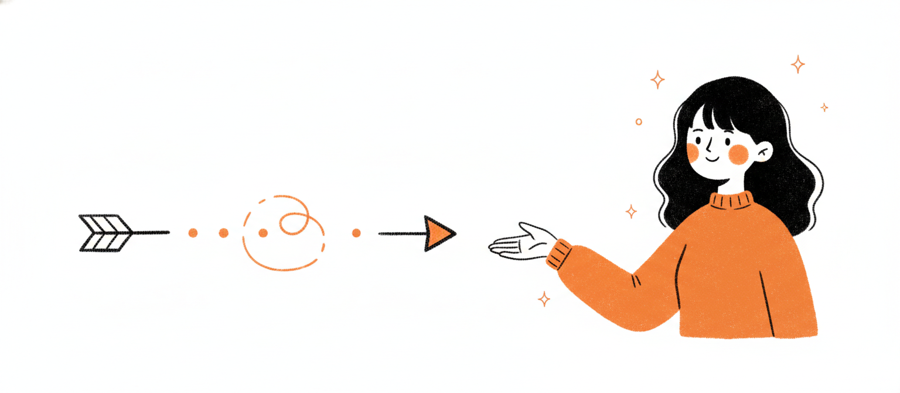
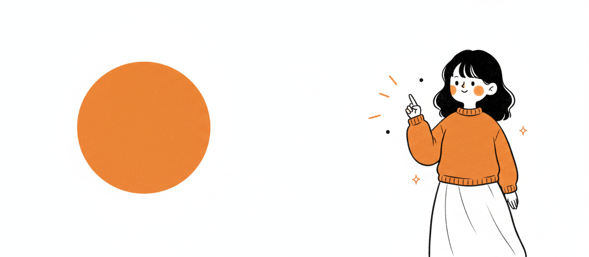
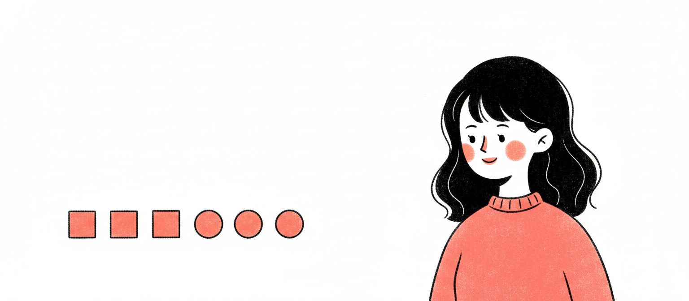
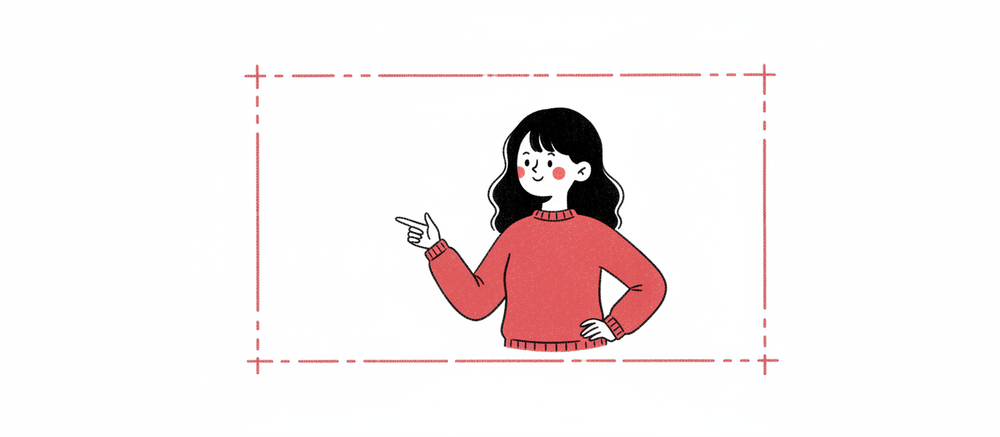
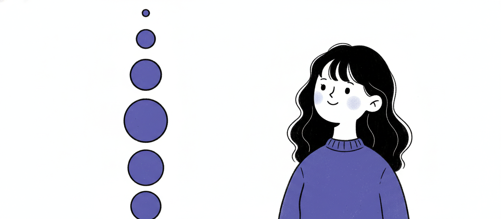
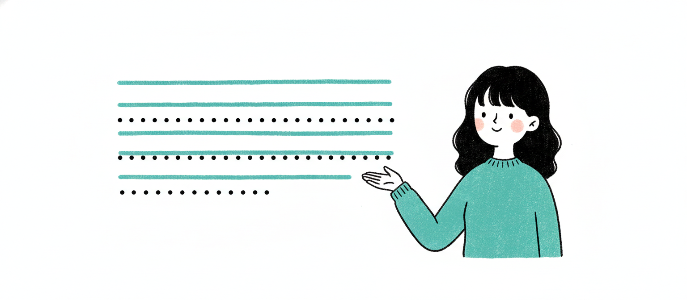
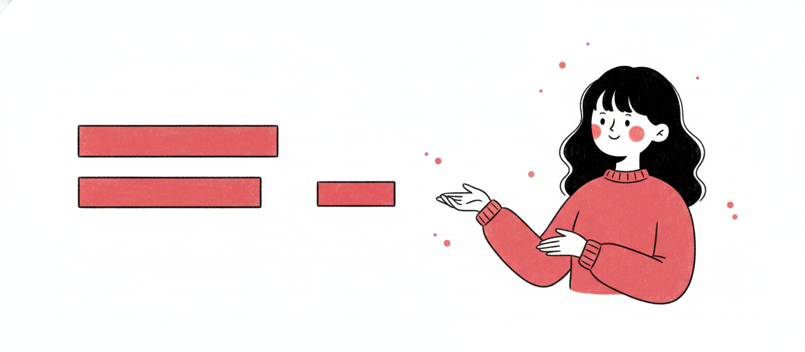
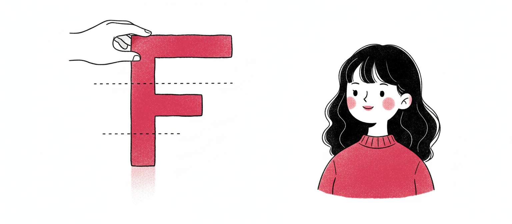

<div align="center">



# Power Design

### A Claude skill for slides that don't look like AI made them.

**Brand DNA × 20 codified design principles → beautiful HTML decks, on demand.**

[**See the principles →**](https://power-design.vercel.app) ·
[**Join the community →**](https://bit.ly/3PATPoL)

</div>

---

## What it does

Power Design is a Claude Code skill that combines two things every other AI deck generator misses:

1. **Brand DNA** — extracted live from any URL via Firecrawl, or picked from **72+ pre-built brand systems** (Stripe, Apple, Linear, Spotify, Vercel, Notion, Tesla, Airbnb…)
2. **20 codified design principles** — pulled from Tufte, Reynolds, Duarte, Williams, Refactoring UI, Müller-Brockmann, Mayer, WCAG 2.2

The result: every deck is both on-brand and objectively well-designed. No purple gradients. No six-bullet hero slides. No drop shadows on bars.

---

## The 20 rules, illustrated

Every slide passes the same 20 checks. **[Read the full field manual →](https://power-design.vercel.app)**

<div align="center">

   
   
   
   
   

</div>

| # | Rule | Source |
|---:|---|---|
|  1 | One idea per slide | Reynolds; Duarte |
|  2 | Glanceable in ≤3 seconds | Duarte; NN/g |
|  3 | ≤7±2 visual chunks; ideal 3–5 | Miller 1956; Cowan 2001 |
|  4 | ≥40% whitespace ratio | Refactoring UI; Reynolds |
|  5 | 5% edge safe-zone, all sides | Broadcast title-safe |
|  6 | Type on a modular scale (1.25–1.618) | Tschichold; Bringhurst |
|  7 | Maximum 4 type sizes per slide | Refactoring UI |
|  8 | Body ≥24px, title ≥48px | Reynolds; Duarte |
|  9 | Line-height 1.4–1.6 body, 1.05–1.2 display | Butterick; Bringhurst |
| 10 | Line length ≤60 characters | Bringhurst |
| 11 | WCAG contrast ≥4.5:1 body, aim 7:1 (AAA) | WCAG 2.2 |
| 12 | 60-30-10 color split | Itten; Refactoring UI |
| 13 | One accent per slide | Tufte |
| 14 | Never encode meaning by hue alone | WCAG 1.4.1 |
| 15 | 8pt grid for all spacing | Bryn Jackson; Material |
| 16 | Align everything to one grid | Müller-Brockmann |
| 17 | Proximity: related ≤16px, unrelated ≥48px | Gestalt; Williams |
| 18 | Data-ink ratio ≥80% | Tufte 1983 |
| 19 | F-pattern: headline + key visual top-left | NN/g eye-tracking |
| 20 | Two valid modes — pick one and stay | Tufte vs Reynolds |

---

## Install

```bash
git clone https://github.com/ItsssssJack/power-design ~/.claude/skills/power-design
```

Then in Claude Code:

```
> use power-design — make me a deck for stripe.com about our new product launch
```

The skill will:
1. Ask you for a brand (paste URL, pick from library, or skip for default)
2. Extract brand DNA via Firecrawl (~30 seconds)
3. Ask for content brief (headline + 3–5 points)
4. Generate `slides.html` applying brand DNA × 20 rules
5. Open in browser. Refine via natural conversation.

---

## Brand library — 72 pre-built systems

| Tech / AI | Finance | Auto / Lifestyle | Media | Productivity |
|---|---|---|---|---|
| Anthropic / Claude · OpenAI · DeepSeek · Linear · Vercel · Stripe · Cursor · GitHub · Figma · Webflow · Framer · Mintlify · Notion · Raycast · Lovable · Resend · Sentry · Supabase · Superhuman · MongoDB · Sanity · Posthog · Replicate · Runway · Hashicorp · ElevenLabs · Cal · Clay · Composio · ClickHouse · Cohere · Mistral · Together · x.ai · Ollama · OpenCode · Expo · Pinterest · Glaido | Stripe · Mastercard · Coinbase · Binance · Kraken · Revolut · Wise · Shopify | Tesla · BMW · BMW M · Bugatti · Ferrari · Lamborghini · Renault · Nike · Airbnb · Apple · Starbucks · Grind · Vodafone | The Verge · Wired · Spotify · YouTube · Sony · PlayStation · IBM | Notion · Slack · Miro · Intercom · Zapier · Uber · NVIDIA · SpaceX · VoltAgent · Warp |

Each entry is a single `brand-style.md` file: colors, type, voice, components, source URL. Add your own using `brands/_template.md`.

---

## How the skill works (under the hood)

```
   ┌─────────────────────────────────────────┐
   │  1. Brand DNA       (URL → Firecrawl)   │
   │     OR pick from    brands/<name>.md    │
   ├─────────────────────────────────────────┤
   │  2. Design rules    principles/...md     │
   ├─────────────────────────────────────────┤
   │  3. Compose         brand × rules → HTML │
   └─────────────────────────────────────────┘
                      ↓
                  slides.html
```

The skill's runbook lives in `SKILL.md`. The 20 design principles (with research citations and numeric thresholds) live in `principles/design-principles.md`.

---

## Credits

- **Brand library** — forked and restructured from [VoltAgent/awesome-design-md](https://github.com/VoltAgent/awesome-design-md), with permission and credit.
- **Design research** — Edward Tufte, Garr Reynolds, Nancy Duarte, Robin Williams (CRAP), Adam Wathan & Steve Schoger (Refactoring UI), Josef Müller-Brockmann, Matthew Butterick, Robert Bringhurst, Richard Mayer, Nielsen Norman Group, WCAG 2.2.
- **Illustrations** — generated via Kie.ai nano-banana 2.

---

## License

MIT — see [LICENSE](LICENSE).

---

<div align="center">

**Built by Jack Roberts** ·
[**Vercel showcase**](https://power-design.vercel.app) ·
[**Community**](https://bit.ly/3PATPoL)

</div>
