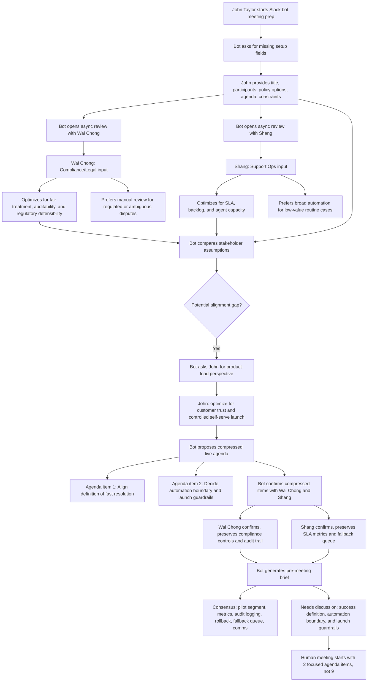

# SeaMoney PayLater Dispute Automation Demo Scenario

## Meeting Setup

**Meeting:** SeaMoney PayLater Dispute Automation Planning

**Goal:** Prepare a human meeting to decide how far to automate PayLater merchant-dispute handling: which cases can be auto-resolved, which require manual review, and what launch criteria should govern the rollout.

**Participants:** Product, Compliance/Legal, Support Operations

**Meeting master:** John Taylor, PayLater Product Lead

**Core hidden issue:** Everyone agrees the team needs "faster resolution," but each person means something different: customer self-serve containment, compliant decisioning, or support SLA/backlog reduction.

The demo ends with a generated agenda and pre-meeting brief. It does not show a final automation policy decision.

## Mermaid Flow



## Slack Bot Demo Script

Use this section as the turn-by-turn input script for the Slack UI. The bot text can be generated by the product; the important part is that the human inputs below are realistic and contain enough signal for the agent loop.

### Turn 1: John Starts The Meeting

**John Taylor -> Bot**

```text
I need to prep a decision meeting for SeaMoney PayLater dispute automation.

We need to decide which merchant-dispute cases can be handled by automation, which cases still need manual review, and what criteria we should use for the first rollout. I want the meeting to be short and focused, so please collect input from the key stakeholders first and generate the final agenda.
```

**Bot should ask John for the missing setup fields:**

- meeting title,
- participants and roles,
- initial agenda,
- known policy options,
- any constraints or context.

### Turn 2: John Provides Meeting Details

**John Taylor -> Bot**

```text
Meeting title: SeaMoney PayLater Dispute Automation Planning

Decision owner: me, John Taylor, PayLater Product Lead.

Participants:
- @waichong, Compliance/Legal Lead
- @shang, Support Operations Lead
- @John Taylor (myself), Product Lead

Decision to prepare: how far we should automate PayLater merchant-dispute handling for the first rollout.

Known policy options:
- Apply provisional credit or conditional adjustment for low-value disputes under a fixed threshold when merchant evidence is missing.
- Auto-reject disputes that fail basic eligibility checks.
- Route restricted merchant categories, repeat claimants, and large-ticket disputes to manual review.
- Start with one market, one dispute reason, and a staff-only shadow-mode pilot before exposing the flow to customers.

Initial agenda:
1. Align on what "fast resolution" means.
2. Decide which dispute types can be auto-resolved.
3. Set value thresholds and manual-review exclusions.
4. Confirm evidence requirements from merchants and customers.
5. Confirm customer communication and appeal messaging.
6. Review abuse, fairness, and compliance controls.
7. Confirm operating metrics and SLA targets.
8. Confirm audit logging and compliance review.
9. Define pilot scope, rollback criteria, and owner.

Additional context: support volume is rising, customers complain about slow PayLater dispute outcomes, and leadership wants a safer self-serve path. We need speed, trust, and operational control, but we cannot let automation create unfair outcomes, avoidable loss, or compliance gaps.
```

**Bot should confirm it will ask Wai Chong for compliance/legal input and Shang for support operations input.**

### Turn 3: Wai Chong Reviews The Agenda

**Bot -> Wai Chong**

```text
John Taylor is preparing a meeting for SeaMoney PayLater Dispute Automation Planning.

John listed you as the Compliance/Legal Lead. I need your compliance and legal view before I compress the agenda.

Please review the draft agenda with a compliance and legal lens:
1. Which cases are safe to automate?
2. Which agenda item must stay in the live meeting?
3. Which items are already safe to treat as agreed?
4. What assumption should I preserve in the brief?
```

**Wai Chong -> Bot**

```text
My goal is to make sure automated dispute outcomes are fair, explainable, and defensible if a customer, merchant, regulator, or internal audit team challenges them. Faster resolution is good, but only if customers still understand the decision and have a real appeal path.

The cases I am comfortable automating are very low-value disputes where merchant evidence is missing, the customer has a clean history, the dispute reason is in the approved pilot category, and the system can issue a clear customer-visible reason code. In those cases, provisional credit or a conditional adjustment can be safe.

The agenda item that must stay live is item 2: decide which dispute types can be auto-resolved, auto-rejected, or routed to manual review. Item 9 should also stay live because pilot scope, rollback criteria, and owner are launch guardrails, not admin details.

The items I am comfortable treating as agreed are:
- item 4: evidence requirements must be explicit for merchants and customers.
- item 5: customer communication must include the decision reason and appeal path.
- item 6: abuse, fairness, and compliance controls are required.
- item 8: audit logging and compliance review are required.

The assumption to preserve is that "fast resolution" only works if the decision is explainable and challengeable. I am not comfortable automating repeat claimants, regulated complaint categories, vulnerable-customer cases, cross-border disputes, or large-ticket cases until Legal signs off on the decision logic and customer messaging.
```

### Turn 4: Shang Reviews The Agenda

**Bot -> Shang**

```text
John Taylor is preparing a meeting for SeaMoney PayLater Dispute Automation Planning.

John listed you as the Support Operations Lead. I need your operations view before I compress the agenda.

Please review the draft agenda with a support lens:
1. Which cases should be automated first?
2. Which agenda item must stay in the live meeting?
3. Which items are already safe to treat as agreed?
4. What assumption should I preserve in the brief?
```

**Shang -> Bot**

```text
My goal is to reduce the dispute backlog and hit a predictable customer SLA. Fast resolution means customers get a clear outcome without waiting days for an agent.

The cases I would automate first are low-value missing-evidence disputes, basic eligibility rejects, and simple customer-upload follow-ups. Those are high-volume enough to matter operationally and structured enough to route without deep agent judgment.

The agenda item that must stay live is item 2: decide which dispute types can be auto-resolved. If the scope is too narrow, we will not reduce volume enough to matter. Item 9 should also stay live unless we already have a named fallback queue owner and rollback threshold.

The items I am comfortable treating as agreed are:
- item 4: merchant and customer evidence requirements should be explicit.
- item 5: customer communication and appeal messaging are required.
- item 7: operating metrics should include first-response time, time to resolution, agent touches, backlog size, reopen rate, and customer satisfaction.
- item 8: audit logging can move to consensus as long as it does not slow agents down.

The assumption to preserve is that "fast resolution" must reduce actual support workload, not just move cases into another manual queue. Anything excluded from automation needs a dedicated fallback queue with a named owner, target SLA, daily backlog monitor, and escalation path.
```

### Turn 5: Bot Detects A Possible Fake Agreement

**Bot -> John Taylor**

```text
Based only on the stakeholder input collected so far, I found a likely alignment gap.

Both Wai Chong and Shang are comfortable with faster dispute resolution, but they are optimizing different outcomes.

Wai Chong is optimizing compliance and legal defensibility: fair treatment, appealability, audit trail, and clear reason codes.
Shang is optimizing operations: SLA, backlog reduction, agent capacity, and customer satisfaction.

From the product-lead side, should the automation plan optimize for customer self-serve trust, compliance defensibility, or support efficiency? Or should the agenda explicitly decide the split between those objectives?
```

**John Taylor -> Bot**

```text
For me, the first rollout needs to prove customers can trust the self-serve path without making Compliance/Legal feel bypassed.

I want fast resolution for clear, low-complexity cases, but I do not want the product story to be "instant refunds for everyone." The launch should feel controlled: clear eligibility rules, visible appeal paths, and enough auditability that Compliance/Legal can review decisions.

So I am comfortable with automation as the default for one market and one dispute reason in a shadow-mode pilot, then a narrow customer-facing segment. I am not comfortable automating repeat claimants, regulated complaint categories, vulnerable-customer cases, large-ticket disputes, or anything with inconsistent evidence.
```

### Turn 6: Bot Asks For Agenda Additions Or Objections

**Bot -> Wai Chong**

```text
I am moving resolved items out of the live meeting and into the pre-read.

Proposed live agenda:
1. Align on what "fast resolution" means: customer trust, compliance defensibility, or support efficiency.
2. Decide the automation boundary and launch guardrails: which cases auto-resolve, auto-reject, or require manual review; pilot scope; rollback threshold; owner.

Compliance/legal check: are you comfortable moving evidence requirements, customer messaging, audit logging, pilot scope, and rollback criteria into consensus?
```

**Wai Chong -> Bot**

```text
No objection. I agree those can go into the consensus brief.

Please preserve that every automated decision needs an audit trail, customer-visible reason code, and appeal path. The pilot must exclude regulated complaint categories, vulnerable-customer cases, repeat claimants, large-ticket disputes, and cases with inconsistent evidence. Also preserve that appeal overturn rate and audit exceptions should be reviewed weekly.
```

**Bot -> Shang**

```text
I am moving resolved items out of the live meeting and into the pre-read.

Proposed live agenda:
1. Align on what "fast resolution" means: customer trust, compliance defensibility, or support efficiency.
2. Decide the automation boundary and launch guardrails: which cases auto-resolve, auto-reject, or require manual review; pilot scope; rollback threshold; owner.

Support check: are you comfortable moving communication, operating metrics, fallback queue, pilot scope, and rollback criteria into consensus?
```

**Shang -> Bot**

```text
No objection, as long as the brief states that cases excluded from automation must route to a dedicated fallback queue with a named owner, target SLA, daily backlog monitor, and escalation path.

I also want the final agenda to make clear that automation scope cannot be so narrow that it has no operational impact. We need a measurable backlog reduction target for the pilot.
```

### Turn 7: Bot Sends Final Pre-Meeting Brief To John

**Bot -> John Taylor**

```text
Pre-meeting prep complete for SeaMoney PayLater Dispute Automation Planning.

Based only on the input collected from John, Wai Chong, and Shang, I reduced the original 9 agenda items to 2 live discussion items.

Pre-meeting brief:
- Agreed: start with one market, one dispute reason, and shadow-mode validation before a narrow customer-facing pilot.
  Source: John proposed this rollout shape; Wai Chong and Shang did not object.
- Agreed: automate clear low-value disputes only when eligibility is clean, evidence is missing or basic checks fail, and the decision reason can be logged.
  Source: Wai Chong accepted low-complexity missing-evidence automation with reason codes; Shang requested low-value missing-evidence and eligibility automation.
- Agreed: regulated complaint categories, vulnerable-customer cases, repeat claimants, large-ticket disputes, and inconsistent-evidence cases require manual review.
  Source: Wai Chong explicitly excluded these cases; John confirmed the same boundary.
- Agreed: excluded cases route to a dedicated fallback queue with a named owner, target SLA, daily backlog monitor, and escalation path.
  Source: Shang requested this; no objections.
- Agreed: customer communication must explain the outcome and preserve an appeal path.
  Source: John asked for trust and appealability; Shang asked for clear customer outcomes.
- Agreed: audit logging, reason codes, and weekly review are required for automated decisions.
  Source: Wai Chong requested audit trail, reason codes, appeal-overturn review, and audit-exception review.
- Agreed: pilot metrics should include resolution time, backlog, agent touches, appeal rate, appeal overturns, audit exceptions, complaint escalations, and customer satisfaction.
  Source: Wai Chong and Shang each supplied their metric sets.

Potential alignment gap:
Everyone is comfortable with "fast resolution," but the success criteria differ:
- Wai Chong optimizes for compliance/legal defensibility: fair treatment, appealability, reason codes, and audit trail.
- Shang optimizes for support operations: SLA, backlog reduction, agent capacity, and customer satisfaction.
- John optimizes for product trust: a controlled self-serve path that customers understand and internal teams can audit.

Recommended meeting agenda:
1. Align on what "fast resolution" means: customer trust, compliance defensibility, or support efficiency.
2. Decide the automation boundary and launch guardrails: which cases auto-resolve, auto-reject, or require manual review; pilot scope; rollback threshold; owner.

Policy tradeoffs:
- Broad automation: largest SLA and backlog impact, but higher compliance, appeal, and fairness risk.
- Narrow pilot: safer launch and easier audit, but may not reduce volume enough.
- Manual-first review: lowest risk, but does not solve the customer wait-time problem.
- Auto-reject eligibility failures: quick operational win, but needs careful customer messaging and appeal handling.
```

## Participants

### Wai Chong, Compliance/Legal Lead

- Goal: make automated dispute decisions fair, explainable, auditable, and legally defensible.
- Preference: narrow automation boundary with clear exclusions, reason codes, and appeal path.
- Says: "Faster resolution is fine for clean, explainable disputes."
- Actually means: speed is acceptable only when the customer communication, evidence trail, and decision reason can survive challenge.
- Concern: opaque automation could create unfair outcomes, complaint escalation, or regulatory exposure.

### Shang, Support Operations Lead

- Goal: reduce dispute backlog, hit SLA, and lower agent touches per case.
- Preference: automate low-value routine cases and basic eligibility outcomes.
- Says: "Customers need a clear outcome without waiting days."
- Actually means: automation must cover enough cases to move operational metrics.
- Concern: a pilot that is too narrow will not reduce volume enough to matter, and manual-review exceptions need a named queue owner.

### John Taylor, PayLater Product Lead

- Meeting-master role: owns the generated pre-meeting brief and decides what goes into the human agenda.
- Goal: launch a trustworthy self-serve path that balances customer speed, compliance/legal defensibility, and operational relief.
- Preference: controlled pilot with clear eligibility, appeal path, and auditability.
- Says: "We need fast resolution customers can trust."
- Actually means: fast for clean cases, explainable and reviewable for everyone else.
- Concern: the product could look unfair if automation is opaque or too aggressive.

## Policy Options

### Broad Automation

Auto-resolve most low-value disputes and auto-reject clear eligibility failures. Highest operational impact, but highest compliance and appeal risk if explanations are weak.

### Narrow Pilot

Automate only one market, one dispute reason, clean low-value missing-evidence cases, and basic eligibility outcomes after shadow-mode validation. Safer launch, but may not reduce backlog enough.

### Manual-First Review

Keep all payment-impacting decisions with agents, using automation only for triage and customer-upload prompts. Lowest compliance risk, weakest SLA impact.

### Auto-Reject Eligibility Failures

Automatically reject disputes that fail basic rules while preserving an appeal path. Useful for volume, but messaging must be clear.

## Starting Agenda

1. Align on what "fast resolution" means.
2. Decide which dispute types can be auto-resolved.
3. Set value thresholds and manual-review exclusions.
4. Confirm evidence requirements from merchants and customers.
5. Confirm customer communication and appeal messaging.
6. Review abuse, fairness, and compliance controls.
7. Confirm operating metrics and SLA targets.
8. Confirm audit logging and compliance review.
9. Define pilot scope, rollback criteria, and owner.

## Async Pre-Meeting Brief

These items are compressible based only on the collected stakeholder input:

- `agreed`: first rollout should use one market, one dispute reason, and shadow-mode validation before customer exposure.
- `agreed`: low-value missing-evidence cases are candidates for automation.
- `agreed`: basic eligibility failures can be automated if messaging and appeals are clear.
- `agreed`: regulated complaint categories, vulnerable-customer cases, repeat claimants, large-ticket disputes, and inconsistent-evidence cases require manual review.
- `agreed`: manual-review cases need a dedicated fallback queue, named owner, target SLA, daily backlog monitor, and escalation path.
- `agreed`: automated decisions need reason codes, audit logging, appeal path, and weekly review.
- `agreed`: pilot metrics must include compliance/legal, customer, and operations outcomes.

No item is finalized by the agent. The meeting owner can pull any compressed item back into the live agenda.

## Generated Meeting Agenda

1. **Align on what "fast resolution" means**
   Compliance/Legal means fair, explainable, and auditable. Support Operations means lower SLA and backlog. Product means customer trust in a controlled self-serve path.

2. **Decide the automation boundary and launch guardrails**
   Decide which disputes auto-resolve, which auto-reject, which require manual review, and what pilot scope, rollback threshold, and owner govern the first rollout.

## Alignment-Gap Reveal

Naive summary:

> "All participants agree the dispute flow needs faster resolution."

Assumption-aware output:

> "Potential alignment gap: participants agree on speed, but optimize different outcomes and control expectations."

Narration line:

> "This looked like agreement. Everyone wanted faster resolution. But Compliance/Legal meant fair and auditable decisioning, Support Ops meant backlog reduction, and Product meant a trustworthy self-serve launch. The system caught that before the meeting, so the agenda starts with the real disagreement."

## Demo Ending

Show the generated pre-meeting brief:

**Compressed from live agenda**

- `agreed`: launch with one market, one dispute reason, and shadow-mode validation before customer exposure.
- `agreed`: automate clean low-value missing-evidence cases and basic eligibility outcomes only with reason codes.
- `agreed`: keep regulated complaint categories, vulnerable-customer cases, repeat-claim, large-ticket, and inconsistent-evidence cases in manual review.
- `agreed`: route manual cases to a dedicated fallback queue with owner, SLA, daily monitor, and escalation path.
- `agreed`: preserve customer reason codes and appeal messaging.
- `agreed`: require audit logging, weekly review, and rollback criteria.

**Needs discussion**

- What does "fast resolution" optimize for: trust, compliance defensibility, or support efficiency?
- Where is the automation boundary and launch guardrail set for the first rollout?

Stop here. Do not show the final automation policy decision.
