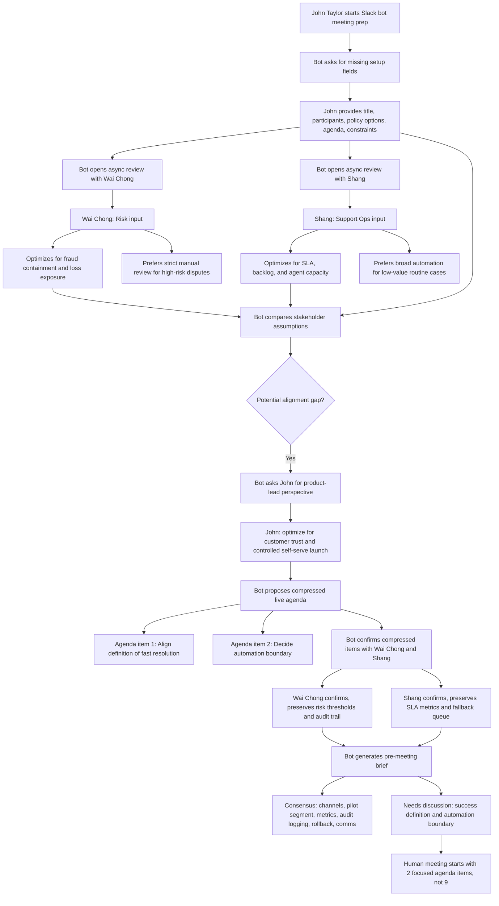

# SeaMoney PayLater Dispute Automation Demo Scenario

## Meeting Setup

**Meeting:** SeaMoney PayLater Dispute Automation Planning

**Goal:** Prepare a human meeting to decide how far to automate PayLater merchant-dispute handling: which cases can be auto-resolved, which require manual review, and what launch criteria should govern the rollout.

**Participants:** Product, Risk, Support Operations

**Meeting master:** John Taylor, PayLater Product Lead

**Core hidden issue:** Everyone agrees the team needs "faster resolution," but each person means something different: customer self-serve containment, fraud-safe decisioning, or support SLA/backlog reduction.

The demo ends with a generated agenda and pre-meeting brief. It does not show a final automation policy decision.

## Mermaid Flow



## Slack Bot Demo Script

Use this section as the turn-by-turn input script for the Slack UI. The bot text can be generated by the product; the important part is that the human inputs below are realistic and contain enough signal for the agent loop.

### Turn 1: John Starts The Meeting

**John Taylor -> Bot**

```text
I need to prep a decision meeting for SeaMoney PayLater dispute automation.

We need to decide which merchant-dispute cases can be handled by automation, which cases still need manual review, and what criteria we should use for the first rollout. I want the meeting to be short and focused, so please collect input from the key stakeholders first and generate the final agenda.
```

**Bot should ask John for the missing setup fields:**

- meeting title,
- participants and roles,
- initial agenda,
- known policy options,
- any constraints or context.

### Turn 2: John Provides Meeting Details

**John Taylor -> Bot**

```text
Meeting title: SeaMoney PayLater Dispute Automation Planning

Decision owner: me, John Taylor, PayLater Product Lead.

Participants:
- @waichong, Risk Lead
- @shang, Support Operations Lead
- @John Taylor (myself), Product Lead

Decision to prepare: how far we should automate PayLater merchant-dispute handling for the first rollout.

Known policy options:
- Auto-credit low-value disputes under a fixed threshold when merchant evidence is missing.
- Auto-reject disputes that fail basic eligibility checks.
- Route high-risk merchants, repeat claimants, and large-ticket disputes to manual review.
- Start with a staff-only pilot before exposing the flow to all customers.

Initial agenda:
1. Align on what "fast resolution" means.
2. Decide which dispute types can be auto-resolved.
3. Set value thresholds and risk exclusions.
4. Confirm evidence requirements from merchants and customers.
5. Confirm customer communication and appeal messaging.
6. Review fraud, abuse, and loss-exposure controls.
7. Confirm operating metrics and SLA targets.
8. Confirm audit logging and compliance review.
9. Define pilot scope, rollback criteria, and owner.

Additional context: support volume is rising, customers complain about slow PayLater dispute outcomes, and leadership wants a safer self-serve path. We need speed, trust, and risk control, but we cannot let automation create avoidable loss or compliance gaps.
```

**Bot should confirm it will ask Wai Chong for risk input and Shang for support operations input.**

### Turn 3: Wai Chong Reviews The Agenda

**Bot -> Wai Chong**

```text
John Taylor is preparing a meeting for SeaMoney PayLater Dispute Automation Planning.

John listed you as the Risk Lead. I need your risk view before I compress the agenda.

Please review the draft agenda with a risk lens:
1. Which cases are safe to automate?
2. Which agenda item must stay in the live meeting?
3. Which items are already safe to treat as agreed?
4. What assumption should I preserve in the brief?
```

**Wai Chong -> Bot**

```text
My goal is to keep fraud and loss exposure controlled. Faster resolution is good, but only if we do not train bad actors to exploit instant credits.

The live meeting needs to decide the automation boundary. I am comfortable with automation for very low-value disputes where merchant evidence is missing and the customer has a clean history.

I am not comfortable auto-crediting repeat claimants, high-risk merchants, cross-border disputes, or large-ticket cases. Those need manual review until we have stronger abuse monitoring.

The metrics I care about are fraud rate, repeat-claim rate, merchant dispute reversal rate, loss per resolved case, and percentage of automated decisions overturned on appeal.
```

### Turn 4: Shang Reviews The Agenda

**Bot -> Shang**

```text
John Taylor is preparing a meeting for SeaMoney PayLater Dispute Automation Planning.

John listed you as the Support Operations Lead. I need your operations view before I compress the agenda.

Please review the draft agenda with a support lens:
1. Which cases should be automated first?
2. Which agenda item must stay in the live meeting?
3. Which items are already safe to treat as agreed?
4. What assumption should I preserve in the brief?
```

**Shang -> Bot**

```text
My goal is to reduce the dispute backlog and hit a predictable customer SLA. Fast resolution means customers get a clear outcome without waiting days for an agent.

The live meeting should keep the question of which cases can be auto-resolved, because if the scope is too narrow we will not reduce volume enough to matter.

My preference is to automate low-value missing-evidence cases, basic eligibility rejects, and simple customer-upload follow-ups. Anything that still needs an agent should enter a dedicated fallback queue with a clear SLA.

The metrics I care about are first-response time, time to resolution, agent touches per dispute, backlog size, reopen rate, and customer satisfaction after resolution.
```

### Turn 5: Bot Detects A Possible Fake Agreement

**Bot -> John Taylor**

```text
Based only on the stakeholder input collected so far, I found a likely alignment gap.

Both Wai Chong and Shang are comfortable with faster dispute resolution, but they are optimizing different outcomes.

Wai Chong is optimizing risk control: fraud rate, repeat claims, loss exposure, and appeal overturns.
Shang is optimizing operations: SLA, backlog reduction, agent capacity, and customer satisfaction.

From the product-lead side, should the automation plan optimize for customer self-serve trust, loss containment, or support efficiency? Or should the agenda explicitly decide the split between those objectives?
```

**John Taylor -> Bot**

```text
For me, the first rollout needs to prove customers can trust the self-serve path without making the risk team feel bypassed.

I want fast resolution for clear, low-risk cases, but I do not want the product story to be "instant refunds for everyone." The launch should feel controlled: clear eligibility rules, visible appeal paths, and enough auditability that Risk and Compliance can review decisions.

So I am comfortable with automation as the default for a narrow pilot segment, but not for repeat claimants, high-risk merchants, large-ticket disputes, or anything with inconsistent evidence.
```

### Turn 6: Bot Asks For Agenda Additions Or Objections

**Bot -> Wai Chong**

```text
I am moving resolved items out of the live meeting and into the pre-read.

Proposed live agenda:
1. Align on what "fast resolution" means: customer trust, loss containment, or support efficiency.
2. Decide the automation boundary: which cases auto-resolve, auto-reject, or require manual review.

Risk check: are you comfortable moving evidence requirements, customer messaging, audit logging, pilot scope, and rollback criteria into consensus?
```

**Wai Chong -> Bot**

```text
No objection. I agree those can go into the consensus brief.

Please preserve that every automated decision needs an audit trail, and the pilot must exclude high-risk merchants, repeat claimants, large-ticket disputes, and cases with inconsistent evidence. Also preserve that appeal overturn rate should be reviewed weekly.
```

**Bot -> Shang**

```text
I am moving resolved items out of the live meeting and into the pre-read.

Proposed live agenda:
1. Align on what "fast resolution" means: customer trust, loss containment, or support efficiency.
2. Decide the automation boundary: which cases auto-resolve, auto-reject, or require manual review.

Support check: are you comfortable moving communication, operating metrics, fallback queue, pilot scope, and rollback criteria into consensus?
```

**Shang -> Bot**

```text
No objection, as long as the brief states that cases excluded from automation must route to a dedicated fallback queue with a target SLA.

I also want the final agenda to make clear that automation scope cannot be so narrow that it has no operational impact. We need a measurable backlog reduction target for the pilot.
```

### Turn 7: Bot Sends Final Pre-Meeting Brief To John

**Bot -> John Taylor**

```text
Pre-meeting prep complete for SeaMoney PayLater Dispute Automation Planning.

Based only on the input collected from John, Wai Chong, and Shang, I reduced the original 9 agenda items to 2 live discussion items.

Pre-meeting brief:
- Agreed: start with a controlled pilot rather than full rollout.
  Source: John proposed a staff-only or narrow pilot; Wai Chong and Shang did not object.
- Agreed: automate clear low-value disputes only when eligibility is clean and evidence is missing or basic checks fail.
  Source: Wai Chong accepted low-risk missing-evidence automation; Shang requested low-value missing-evidence and eligibility automation.
- Agreed: high-risk merchants, repeat claimants, large-ticket disputes, and inconsistent-evidence cases require manual review.
  Source: Wai Chong explicitly excluded these cases; John confirmed the same boundary.
- Agreed: excluded cases route to a dedicated fallback queue with a clear SLA.
  Source: Shang requested this; no objections.
- Agreed: customer communication must explain the outcome and preserve an appeal path.
  Source: John asked for trust and appealability; Shang asked for clear customer outcomes.
- Agreed: audit logging and weekly review are required for automated decisions.
  Source: Wai Chong requested audit trail and appeal-overturn review.
- Agreed: pilot metrics should include resolution time, backlog, agent touches, fraud rate, loss per resolved case, appeal overturns, and customer satisfaction.
  Source: Wai Chong and Shang each supplied their metric sets.

Potential alignment gap:
Everyone is comfortable with "fast resolution," but the success criteria differ:
- Wai Chong optimizes for risk control: fraud rate, repeat claims, loss exposure, and appeal overturns.
- Shang optimizes for support operations: SLA, backlog reduction, agent capacity, and customer satisfaction.
- John optimizes for product trust: a controlled self-serve path that customers understand and internal teams can audit.

Recommended meeting agenda:
1. Align on what "fast resolution" means: customer trust, loss containment, or support efficiency.
2. Decide the automation boundary: which cases auto-resolve, auto-reject, or require manual review.

Policy tradeoffs:
- Broad automation: largest SLA and backlog impact, but higher fraud and loss exposure.
- Narrow pilot: safer launch and easier audit, but may not reduce volume enough.
- Manual-first review: lowest risk, but does not solve the customer wait-time problem.
- Auto-reject eligibility failures: quick operational win, but needs careful customer messaging and appeal handling.
```

## Participants

### Wai Chong, Risk Lead

- Goal: control fraud, abuse, and loss exposure from automated dispute decisions.
- Preference: narrow automation boundary with strict exclusions.
- Says: "Faster resolution is fine for clean, low-risk disputes."
- Actually means: speed is acceptable only when repeat-claim, merchant-risk, value, and evidence checks are safe.
- Concern: instant credits could train abuse and create avoidable losses.

### Shang, Support Operations Lead

- Goal: reduce dispute backlog, hit SLA, and lower agent touches per case.
- Preference: automate low-value routine cases and basic eligibility outcomes.
- Says: "Customers need a clear outcome without waiting days."
- Actually means: automation must cover enough cases to move operational metrics.
- Concern: a pilot that is too narrow will not reduce volume enough to matter.

### John Taylor, PayLater Product Lead

- Meeting-master role: owns the generated pre-meeting brief and decides what goes into the human agenda.
- Goal: launch a trustworthy self-serve path that balances customer speed, risk control, and operational relief.
- Preference: controlled pilot with clear eligibility, appeal path, and auditability.
- Says: "We need fast resolution customers can trust."
- Actually means: fast for clean cases, explainable and reviewable for everyone else.
- Concern: the product could look unfair if automation is opaque or too aggressive.

## Policy Options

### Broad Automation

Auto-resolve most low-value disputes and auto-reject clear eligibility failures. Highest operational impact, but highest risk if abuse monitoring is weak.

### Narrow Pilot

Automate only clean, low-value, missing-evidence cases and basic eligibility outcomes. Safer launch, but may not reduce backlog enough.

### Manual-First Review

Keep all payment-impacting decisions with agents, using automation only for triage and customer-upload prompts. Lowest risk, weakest SLA impact.

### Auto-Reject Eligibility Failures

Automatically reject disputes that fail basic rules while preserving an appeal path. Useful for volume, but messaging must be clear.

## Starting Agenda

1. Align on what "fast resolution" means.
2. Decide which dispute types can be auto-resolved.
3. Set value thresholds and risk exclusions.
4. Confirm evidence requirements from merchants and customers.
5. Confirm customer communication and appeal messaging.
6. Review fraud, abuse, and loss-exposure controls.
7. Confirm operating metrics and SLA targets.
8. Confirm audit logging and compliance review.
9. Define pilot scope, rollback criteria, and owner.

## Async Pre-Meeting Brief

These items are compressible based only on the collected stakeholder input:

- `agreed`: first rollout should be a controlled pilot, not full rollout.
- `agreed`: low-value missing-evidence cases are candidates for automation.
- `agreed`: basic eligibility failures can be automated if messaging and appeals are clear.
- `agreed`: repeat claimants, high-risk merchants, large-ticket disputes, and inconsistent-evidence cases require manual review.
- `agreed`: manual-review cases need a dedicated fallback queue and SLA.
- `agreed`: automated decisions need audit logging and weekly review.
- `agreed`: pilot metrics must include both risk and operations outcomes.

No item is finalized by the agent. The meeting owner can pull any compressed item back into the live agenda.

## Generated Meeting Agenda

1. **Align on what "fast resolution" means**
   Risk means fraud-safe and loss-controlled. Support Operations means lower SLA and backlog. Product means customer trust in a controlled self-serve path.

2. **Decide the automation boundary**
   Decide which disputes auto-resolve, which auto-reject, and which require manual review for the first rollout.

## Alignment-Gap Reveal

Naive summary:

> "All participants agree the dispute flow needs faster resolution."

Assumption-aware output:

> "Potential alignment gap: participants agree on speed, but optimize different outcomes and risk tolerance."

Narration line:

> "This looked like agreement. Everyone wanted faster resolution. But Risk meant loss-safe decisioning, Support Ops meant backlog reduction, and Product meant a trustworthy self-serve launch. The system caught that before the meeting, so the agenda starts with the real disagreement."

## Demo Ending

Show the generated pre-meeting brief:

**Compressed from live agenda**

- `agreed`: launch as a controlled pilot.
- `agreed`: automate clean low-value missing-evidence cases and basic eligibility outcomes.
- `agreed`: keep high-risk, repeat-claim, large-ticket, and inconsistent-evidence cases in manual review.
- `agreed`: route manual cases to a dedicated fallback queue with SLA.
- `agreed`: preserve customer appeal messaging.
- `agreed`: require audit logging, weekly review, and rollback criteria.

**Needs discussion**

- What does "fast resolution" optimize for: trust, loss containment, or support efficiency?
- Where is the automation boundary for the first rollout?

Stop here. Do not show the final automation policy decision.
